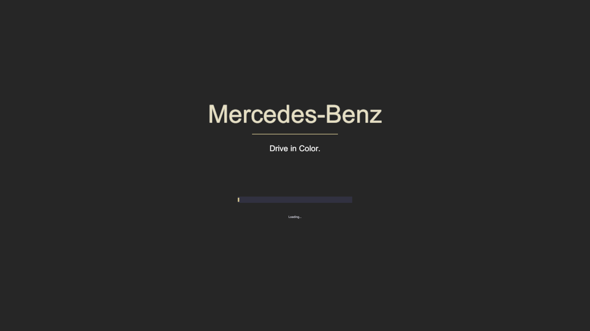
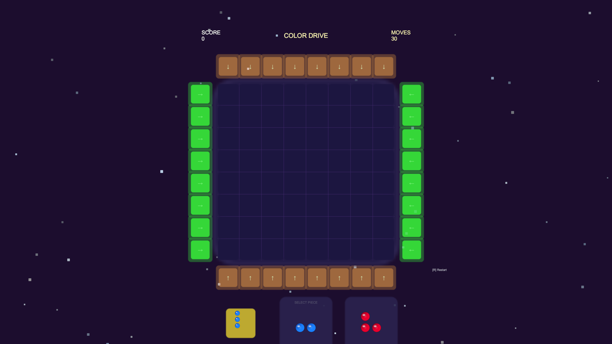
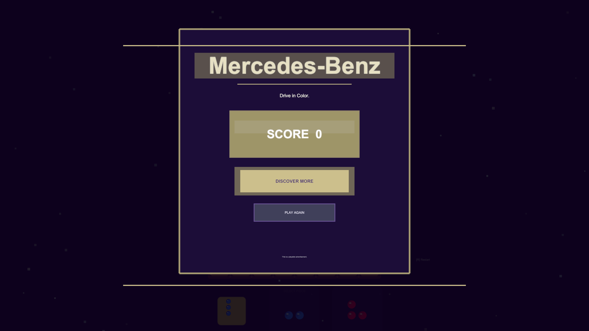

# Color Drive: Hybrid Puzzle Game

> A Mercedes-Benz branded playable advertisement — Block Slide Puzzle meets starfield visuals in a zero-dependency Unity framework.

<!-- Badges -->
[](https://unity.com/)
[](https://unity.com/features/webgl)
[](LICENSE)
[](https://github.com/JEO-tech-ai/playable_games/tree/feature/hybrid-puzzle)
[](https://learn.microsoft.com/en-us/dotnet/csharp/)
[](https://github.com/JEO-tech-ai/playable_games)
[](https://github.com/JEO-tech-ai/playable_games)
[](https://github.com/JEO-tech-ai/playable_games)

---

## Screenshots

| Loading Screen | Gameplay | Endcard |
|:-:|:-:|:-:|
|  |  |  |
| Brand identity · progress bar | 8×8 grid · starfield bg · 3D gem pieces | Score badge · CTA · Play Again |

---

## Table of Contents

- [Project Overview](#project-overview)
- [Game Flow](#game-flow)
- [Core Mechanics & Fun Elements](#core-mechanics--fun-elements)
- [How to Play](#how-to-play)
- [Scoring System](#scoring-system)
- [Technical Architecture](#technical-architecture)
- [Brand Customization](#brand-customization)
- [Level Design Guide](#level-design-guide)
- [Ad Integration](#ad-integration)
- [Development Notes](#development-notes)

---

## Project Overview

**Color Drive: Hybrid Puzzle** is a production-ready playable advertisement framework built with Unity 6000.3.10f1. It combines a polished block-placement puzzle with a starfield visual environment, packaged as a three-phase ad flow (Loading → Gameplay → Endcard).

### Key Features

| Feature | Details |
|---------|---------|
| **8×8 Block Puzzle** | Slide pieces from 4 directions into a colored grid |
| **3D Gem Sprites** | Procedurally generated — no external assets required |
| **Starfield Background** | 80 twinkling stars with sine-wave alpha flicker |
| **Slot Pulse Animation** | Green arrows pulse smoothstep at 2.5 Hz to guide players |
| **Sparkle Clear FX** | 6-particle burst when blocks clear, color-matched per piece |
| **Score Floating Text** | "+N" popup floats upward and fades on each clear |
| **Endcard Pop-In** | ScaleTo bounce from zero → one with gold-bordered panel |
| **Event-Driven Flow** | `OnGameEnded` event decouples puzzle logic from ad orchestration |
| **Zero External Deps** | No LeanTween, DOTween, TextMesh Pro, or Addressables |
| **Both Input Systems** | Legacy `OnMouseDown` + New Input System active simultaneously |

---

## Game Flow

```
┌──────────────────────────────────────────────────────────┐
│  LOADING SCREEN  (1.5 s)                                  │
│  · Brand name · Gold divider · Tagline · Progress bar     │
├──────────────────────────────────────────────────────────┤
│  GAMEPLAY  (30 s max)                                     │
│  · Starfield background                                   │
│  · 8×8 grid — place pieces via directional arrows         │
│  · Pulsing green arrows guide first-time players          │
│  · Timer bar: blue → yellow → red as time runs out        │
│  · Floating score popups on every clear                   │
│  · Board clear OR moves exhausted → immediate endcard     │
├──────────────────────────────────────────────────────────┤
│  ENDCARD                                                  │
│  · Pop-in bounce animation                                │
│  · Score badge with gold inner shine                      │
│  · "DISCOVER MORE" CTA (opens brand URL)                  │
│  · "PLAY AGAIN" restarts scene                            │
└──────────────────────────────────────────────────────────┘
```

---

## Core Mechanics & Fun Elements

### Piece Placement System

Pieces slide in from **4 directions** via arrow buttons around the grid:

```
           ↓ ↓ ↓ ↓ ↓ ↓ ↓ ↓   (Top arrows)
         ┌─────────────────┐
    → →  │                 │  ← ←
    → →  │   8 × 8 Grid    │  ← ←
    → →  │                 │  ← ←
         └─────────────────┘
           ↑ ↑ ↑ ↑ ↑ ↑ ↑ ↑   (Bottom arrows)
```

- **Left (→)** — Piece enters from left edge, occupies first open cell in that row
- **Right (←)** — Piece enters from right edge
- **Top (↓)** — Piece enters from top, slides to first open cell in that column
- **Bottom (↑)** — Piece enters from bottom

### Clear Conditions

Four ways to clear blocks — any can chain in a single move:

| Pattern | Rule | Reward |
|---------|------|--------|
| **Full Row** | All 8 cells in a row, same color | Full row clears |
| **Full Column** | All 8 cells in a column, same color | Full column clears |
| **H-Run 3+** | 3 or more consecutive same-color in a row | All matching cells clear |
| **V-Run 3+** | 3 or more consecutive same-color in a column | All matching cells clear |

### Scoring Formula

```
Points = Cleared × 10 × (1 + Cleared / 5)
```

| Cleared | Multiplier | Points |
|---------|-----------|--------|
| 1 | 1.2× | 12 |
| 4 | 1.8× | 72 |
| 8 | 2.6× | 208 |
| 16 | 4.2× | 672 |

### Fun Elements

- **Auto-Select** — First piece is pre-selected on load; no tutorial needed
- **Piece Bounce** — Selecting a queue piece triggers a 1.0 → 1.1 → 1.0 scale animation
- **Placement Punch** — Each placed cell punches to 1.25× then springs back
- **Color Glow Ring** — Each filled cell gets a color-matched aura ring
- **Cell Flash** — Clearing cells flash white before disappearing
- **Sparkle Burst** — 6 color-matched particles explode outward on clear
- **Red Moves Warning** — Move counter turns red when ≤ 5 moves remain
- **Slot Hover** — Arrows brighten on mouse hover for tactile feedback
- **[R] Restart** — Instant keyboard restart at any time

---

## How to Play

### Block Puzzle Mode

> **Goal:** Clear as many colored blocks as possible in 30 moves.

1. **Queue** — Three colored pieces shown at the bottom
2. **Select** — Click a piece in the queue (gold highlight = selected; auto-selects piece 0 on start)
3. **Place** — Click any **green arrow** (left/right) or **orange arrow** (top/bottom)
4. **Clear** — Matching patterns clear automatically with a sparkle burst
5. **Score** — Floating "+N" shows points; chase combos for exponential rewards
6. **Win** — Clear the entire board early, or play out all 30 moves

#### Controls

| Input | Action |
|-------|--------|
| Click queue piece | Select piece |
| Click slot arrow | Place selected piece |
| `R` | Restart |

---

## Technical Architecture

### Project Structure

```
Assets/
├── Scripts/
│   ├── BlockPuzzle/
│   │   └── BlockPuzzleGame.cs        ← Self-contained puzzle (grid + input + visuals)
│   ├── Managers/
│   │   ├── PlayableAdController.cs   ← Loading → Gameplay → Endcard orchestration
│   │   └── TweenHelper.cs            ← Zero-dep coroutine tweens (ScaleTo, MoveY, ColorTo)
│   ├── UI/   ← HUD, result, level select, pause
│   └── Data/ ← ThemeConfig SO, LevelData SO
├── Scenes/
│   └── SampleScene.unity             ← Single scene; all objects built at runtime
└── Screenshots/
    └── *.png                         ← Auto-captured verification screenshots
```

### Key Components

#### `BlockPuzzleGame.cs` — Core Logic

```csharp
// Public API
public int Score => _score;
public int SelectedPieceIdx => _selectedPiece;
public System.Action<int> OnGameEnded;   // fired: board clear OR moves=0

// Input entry points
public void OnSlotClicked(Dir dir, int slotIdx);
public void OnQueueSlotClicked(int idx);
```

**Procedural visuals built entirely at runtime:**
- `MakeRoundedSprite(64px, cornerPct=0.25)` — anti-aliased rounded rect
- `MakePieceSprite(base, highlight, shadow)` — 5-pass 3D gem (shadow, glow, rim, specular)
- `BuildStarfield()` — 80 twinkling stars with `StarTwinkleCoroutine`
- `SlotPulseCoroutine()` — smoothstep PingPong at 2.5 Hz
- `SparkCoroutine()` — 6-particle clear burst, color-matched from glow child

#### `PlayableAdController.cs` — Ad Flow

```csharp
public enum AdPhase { Loading, Gameplay, Endcard }

// Event-driven: no polling
_game.OnGameEnded += (score) => { _finalScore = score; _gameEndedByPlayer = true; };

// Timer bar: blue→yellow→red
Color tc = pct > 0.5f
    ? Color.Lerp(new Color(1f,0.8f,0f), new Color(0.4f,0.8f,1f), (pct-0.5f)*2f)
    : Color.Lerp(Color.red, new Color(1f,0.8f,0f), pct*2f);
```

#### `TweenHelper.cs` — Zero-Dependency Tweens

```csharp
TweenHelper.ScaleTo(go, Vector3.one * 1.25f, 0.08f, () =>
    TweenHelper.ScaleTo(go, Vector3.one, 0.12f));
TweenHelper.MoveY(go, targetY, 0.3f);
TweenHelper.ColorTo(spriteRenderer, fromColor, toColor, 0.2f);
```

All tweens use `Time.unscaledDeltaTime` — pause-safe.

### Visual Design

| Element | Color |
|---------|-------|
| Background | `#1A0A2E` deep indigo |
| Grid panel | `#2A1F4E` royal purple |
| Empty cells | `#1E163F` dark purple |
| Slot arrows | Green `(0.3, 0.9, 0.3)` pulsing |
| HUD title | Gold `(1.0, 0.9, 0.4)` |
| Piece palette | 7 candy-vivid colors (Red/Orange/Yellow/Green/Blue/Purple/Cyan) |

---

## Brand Customization

### 5-Minute Brand Swap

```
1. Open SampleScene → select ColorDriveGame GameObject
2. In PlayableAdController Inspector:
   - brandName   → "Nike"
   - tagline     → "Just Do It."
   - ctaText     → "SHOP NOW"
   - brandPrimary → black
   - brandAccent  → neon yellow
3. Press Play — all screens update automatically
```

### Theme Fields

| Field | Default | Effect |
|-------|---------|--------|
| `brandName` | "Mercedes-Benz" | Loading + endcard title |
| `tagline` | "Drive in Color." | Below brand name |
| `ctaText` | "DISCOVER MORE" | Endcard button label |
| `brandPrimary` | `#262626` dark | Loading bg + endcard overlay |
| `brandAccent` | `#CCC08D` gold | Dividers, badges, CTA button |

---

## Level Design Guide

### Block Puzzle Difficulty Tuning

| Parameter | Easy | Medium | Hard |
|-----------|------|--------|------|
| `movesAllowed` | 40 | 30 | 20 |
| Grid size | 6×6 | 8×8 | 8×8 |
| Piece shapes | 1–2 cell only | All shapes | All shapes |

### Scoring Targets

```
Points = Cleared × 10 × (1 + Cleared / 5)

Target for 1-star: any completion
Target for 2-star: score ≥ 200
Target for 3-star: score ≥ 500 (requires multi-clear combos)
```

---

## Ad Integration

### Endcard CTA

```csharp
// PlayableAdController.OnCTAPressed()
Application.OpenURL("https://www.mercedes-benz.com");
```

Replace URL with your campaign landing page.

### Tracking Integration

```csharp
// Add to ShowEndcard():
FireAnalyticsEvent("playable_complete", new Dictionary<string,object> {
    { "score", score },
    { "brand", brandName },
    { "moves_used", movesAllowed - _game._movesLeft }
});
```

### Timing Configuration

| Parameter | Default | Range |
|-----------|---------|-------|
| `loadingDuration` | 1.5s | 1–3s |
| `gameplayTimeLimit` | 30s | 15–60s |
| Endcard display | Unlimited | — |

---

## Development Notes

### Input System

```
activeInputHandler = 2  (Both)
→ Legacy OnMouseDown + New Input System both active
→ Keyboard R via #if ENABLE_INPUT_SYSTEM guard
```

### No External Dependencies

| Dep | Status | Replacement |
|----|--------|-------------|
| LeanTween / DOTween | ✗ None | `TweenHelper.cs` coroutine tweens |
| TextMesh Pro | ✗ None | Built-in `TextMesh` + `MeshRenderer.sortingOrder` |
| Addressables | ✗ None | Procedural runtime construction |
| External sprites | ✗ None | `MakeRoundedSprite` + `MakePieceSprite` |

### Known Limitations

- Audio not implemented (deferred — requires external package or AudioClip assets)
- Water Sort mode is scaffolded but not wired to the ad flow
- Preset level layouts (JSON) are framework-ready but not parsed at runtime

---

## Troubleshooting

| Symptom | Fix |
|---------|-----|
| Grid not appearing | Check `BlockPuzzleGame` attached to GameObject; Camera at z=-10, orthographic |
| Arrows not clickable | Verify `activeInputHandler=2` in ProjectSettings; needs BoxCollider2D |
| Text invisible on endcard | `MeshRenderer.sortingOrder` must exceed overlay sortingOrder (≥65) |
| IndexOutOfRange in HighlightQueueSlot | Lambda must capture GO reference, not loop index `i` |
| Endcard not showing | Check `PlayableAdController` is in scene; `OnGameEnded` event subscribed |

---

## File Reference

| Path | Purpose |
|------|---------|
| `My project/Assets/Scripts/BlockPuzzle/BlockPuzzleGame.cs` | Core puzzle logic + all procedural visuals |
| `My project/Assets/Scripts/Managers/PlayableAdController.cs` | Ad flow orchestrator |
| `My project/Assets/Scripts/Managers/TweenHelper.cs` | Lightweight tween engine |
| `My project/Assets/Scenes/SampleScene.unity` | Main playable ad scene |
| `My project/ProjectSettings/ProjectSettings.asset` | `activeInputHandler=2` |
| `docs/screenshots/` | README game screenshots |
| `history/` | Phase-by-phase development logs (01–09) |

---

**Last Updated:** March 16, 2026 · **Unity:** 6000.3.10f1 · **Branch:** `feature/hybrid-puzzle`
